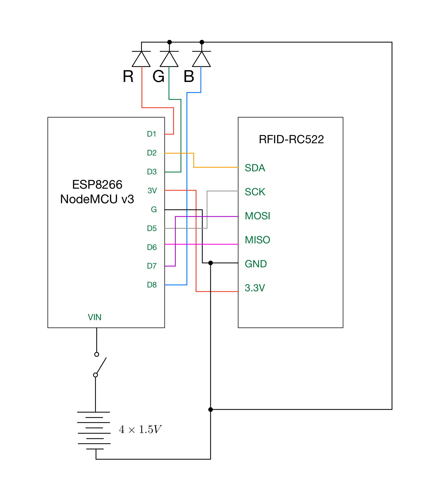

# Wiring

| RFID-RC522 | NodeMCU  |
|------------|----------|
| SDA        | D2       |
| SCK        | D5       |
| MOSI       | D7       |
| MISO       | D6       |
| IRQ        | (Unused) |
| GND        | G        |
| RST        | (Unused) |
| 3.3V       | 3V       |

| RGB LED\*  | NodeMCU  |
|------------|----------|
| Red        | D1       |
| Ground     | G        |
| Green      | D3       |
| Blue       | D8       |

\* Note that the RGB LED in this configuration is common cathode.

When developing and debugging, the unit will be powered via USB. In deployment, the unit will be powered via 4x AA batteries, toggled with a switch.

| Power  | NodeMCU |
|--------|---------|
| +      | VIN     |
| -      | GND     |

The following circuit diagram may be used for quick reference:

